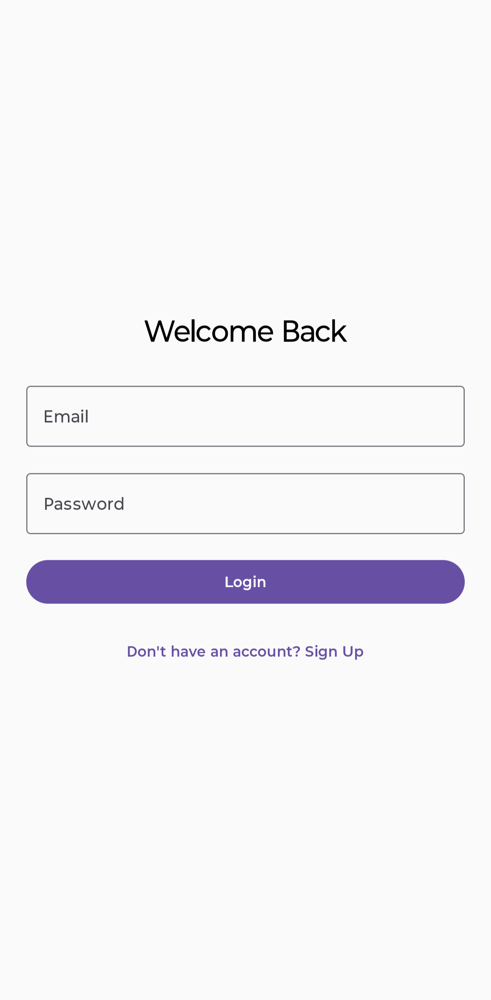
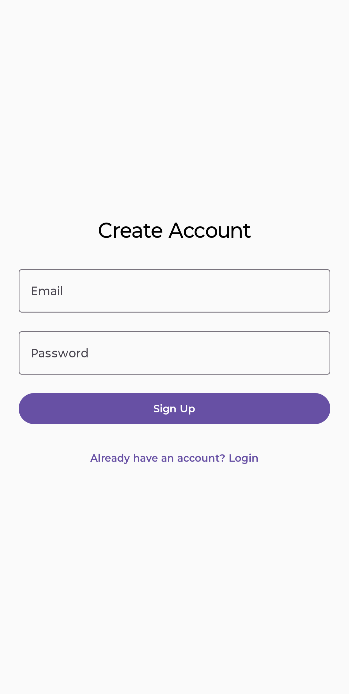
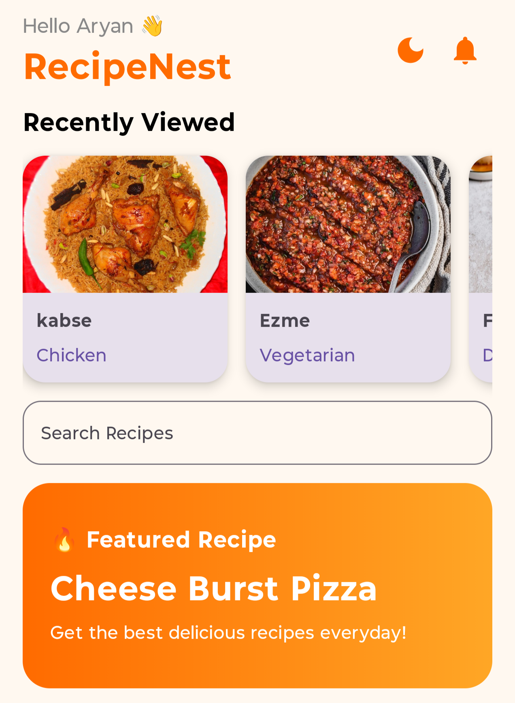
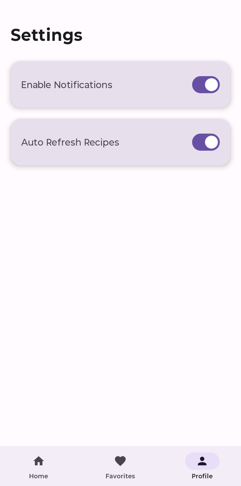
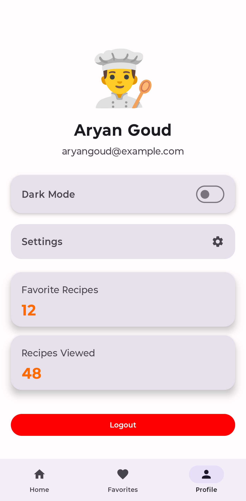
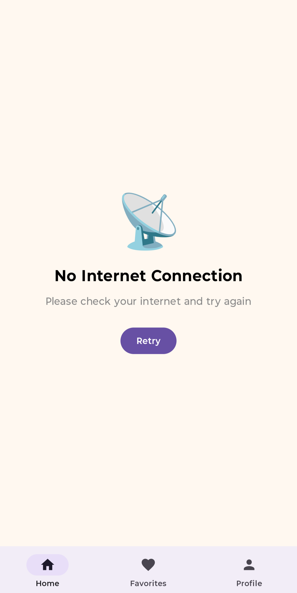
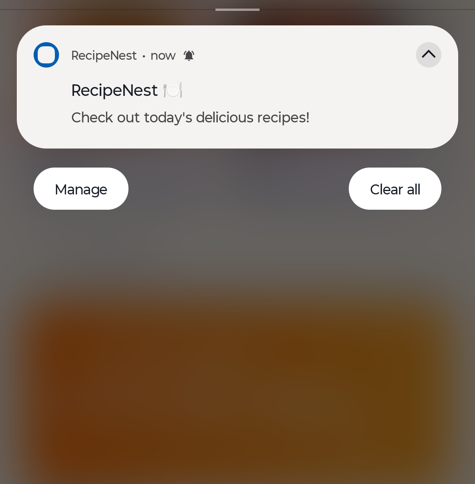

### 🍽️ RecipeNest – Modern Android Recipe App

RecipeNest is a professional Android Recipe Application built using Kotlin and Jetpack Compose in Android Studio as part of the ApexPlanet Android App Development Internship.

The app provides a beautiful modern UI, real-time recipe fetching, Firebase Authentication, Room Database persistence, offline handling, notifications, DataStore preferences, and production-level Android architecture.

---

# ✨ Features

## 🚀 Core Features

- Splash Screen
- Modern Jetpack Compose UI
- Bottom Navigation
- Real-Time Recipe API Integration
- Internet Recipe Images
- Search Functionality
- Recipe Detail Screen
- Favorites Screen
- Profile Screen
- Settings Screen
- Dark Mode Support
- Responsive Layout

---

# 🔐 Authentication Features

- Firebase Authentication
- User Signup & Login
- Persistent User Sessions
- Logout Functionality
- Authentication Error Handling
- Loading Indicators

---

# 🌐 API & Backend Features

- Retrofit API Integration
- JSON Parsing using Gson
- Real Recipe Fetching
- Dynamic Recipe Loading
- Pull-to-Refresh Support
- Error Handling UI
- Empty State UI
- Smooth Data Updates

---

# ❤️ Database Features

- Room Database Integration
- Persistent Favorites
- Offline Favorite Storage
- Real-Time Favorite Updates

---

# ⚙️ Settings & Preferences

- Settings Screen
- Notification Toggle
- Auto Refresh Toggle
- DataStore Preferences
- Persistent Settings Storage

---

# 🌍 Offline & Connectivity Features

- Internet Connectivity Detection
- Offline UI Screen
- Retry System
- Better Network Error Handling

---

# 🔔 Notification Features

- Local Push Notifications
- Notification Permission Handling
- Notification Channel Support
- Recipe Reminder Notifications

---

# 🕒 User Experience Features

- Recently Viewed Recipes
- Horizontal Recent Recipe Cards
- Real-Time Recipe Tracking
- Smooth Navigation Animations
- Search + Category Combined Filtering

---

# 🎨 UI/UX Features

- Featured Recipe Banner
- Category Filtering
- Shimmer Loading Animation
- Smooth Screen Transitions
- Modern Material 3 Design
- Interactive Favorite Button
- Beautiful Card Layouts
- Professional Typography & Spacing

---

# 🛠️ Technologies Used

| Technology | Purpose |
|------------|----------|
| Kotlin | Programming Language |
| Jetpack Compose | Modern Android UI |
| Retrofit | API Integration |
| Gson Converter | JSON Parsing |
| Coil | Image Loading |
| Room Database | Local Storage |
| Firebase Authentication | User Authentication |
| DataStore | Persistent Preferences |
| Material 3 | UI Components |
| Coroutines | Asynchronous Programming |

---

# 🌐 API Used

## TheMealDB API

https://www.themealdb.com/api.php

Used for:
- Fetching recipes
- Recipe images
- Recipe categories
- Recipe instructions

---

# 📱 App Screenshots

## 🔐 Login Screen



---

## 📝 Signup Screen



---

## 🕒 Recently Viewed Recipes



---

## ⚙️ Settings Screen



---

## 👨‍🍳 Enhanced Profile Screen



---

## 🌍 Offline Detection Screen



---

## 🔔 Push Notifications



---

# 📂 Project Structure

```bash
com.example.recipenest
│
├── api
│   ├── RecipeApiService.kt
│   ├── FavoriteRecipeDao.kt
│   ├── RecipeDatabase.kt
│   └── RetrofitInstance.kt
│
├── auth
│   ├── LoginScreen.kt
│   ├── SignupScreen.kt
│   └── AuthViewModel.kt
│
├── components
│   ├── CategoryChip.kt
│   ├── FeaturedBanner.kt
│   ├── OnlineRecipeCard.kt
│   ├── RecentRecipeCard.kt
│   ├── ShimmerRecipeCard.kt
│   ├── ThemeManager.kt
│   └── SettingsManager.kt
│
├── model
│   ├── OnlineRecipe.kt
│   ├── FavoriteRecipeEntity.kt
│   └── RecentRecipe.kt
│
├── screens
│   ├── HomeScreen.kt
│   ├── FavoriteScreen.kt
│   ├── ProfileScreen.kt
│   ├── SettingsScreen.kt
│   └── RecipeDetailScreen.kt
│
├── utils
│   ├── NetworkUtils.kt
│   ├── NotificationHelper.kt
│   ├── RecentRecipeManager.kt
│   └── SettingsDataStore.kt
│
├── viewmodel
│   └── AuthViewModel.kt
│
└── MainActivity.kt
```

---

# 🚀 Installation

## 1️⃣ Clone the repository

```bash
git clone https://github.com/aryangoud8978/RecipeNest-Task4.git
```

---

## 2️⃣ Open in Android Studio

Open the project using Android Studio Hedgehog or newer.

---

## 3️⃣ Sync Gradle

Allow Gradle Sync to complete successfully.

---

## 4️⃣ Add Firebase Configuration

Download and place:

```text
google-services.json
```

inside:

```text
app/
```

---

## 5️⃣ Run the Application

Connect emulator or Android device and run the app.

---

# 👨‍💻 Developer

## Aryan Goud

Built with ❤️ using Kotlin & Jetpack Compose