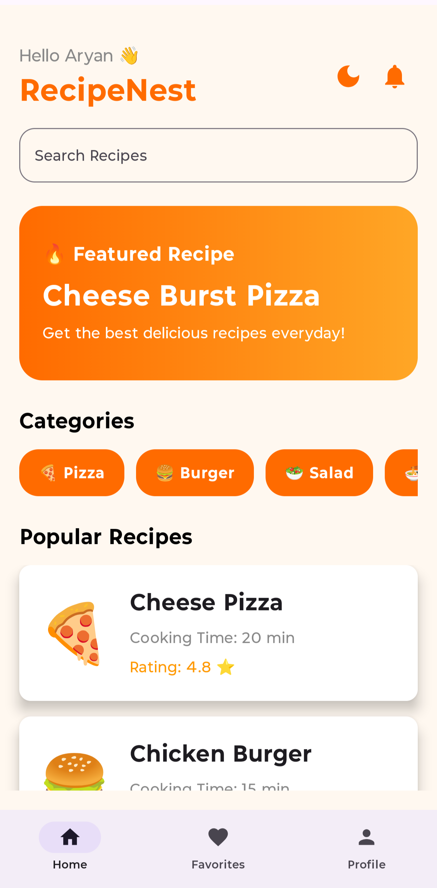
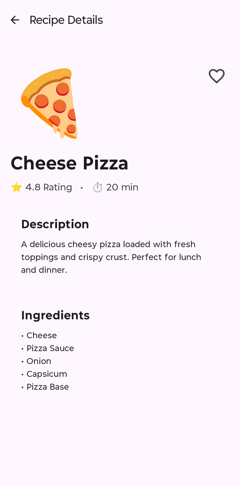
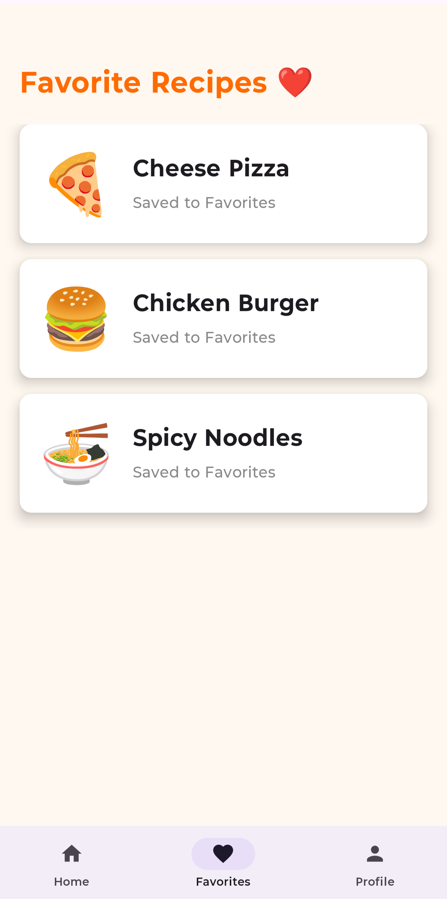
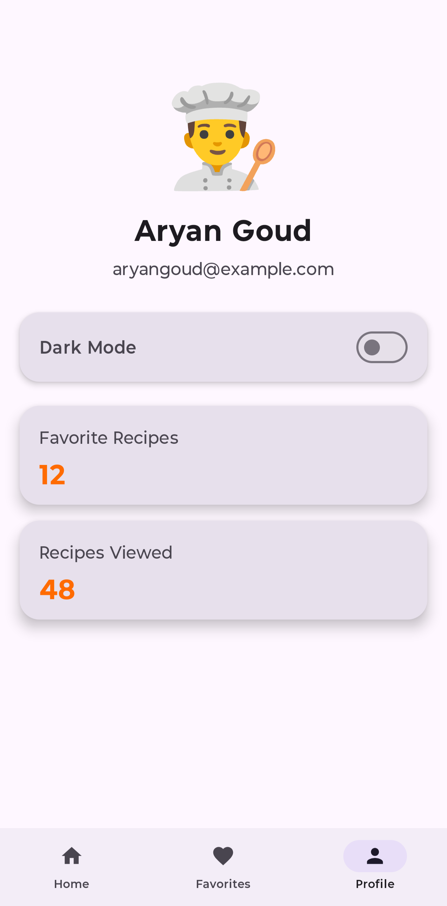
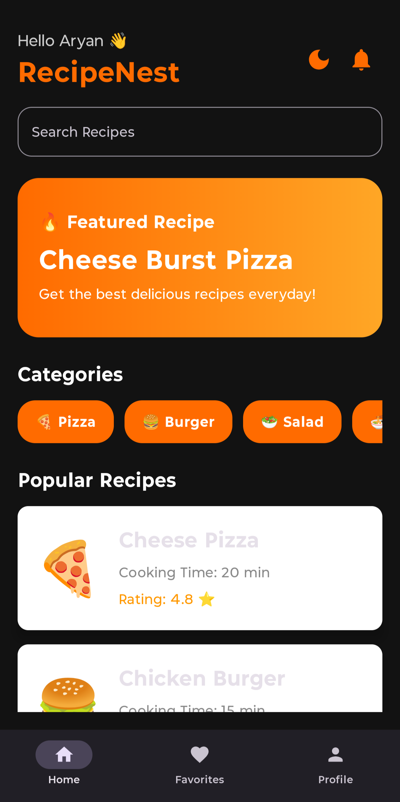

# 🍔 RecipeNest

RecipeNest is a modern Android Recipe App built using Jetpack Compose in Android Studio.

---

# ✨ Features

- Splash Screen
- Modern UI Design
- Bottom Navigation
- Search Functionality
- Featured Recipe Banner
- Categories Section
- Recipe Detail Screen
- Favorite Toggle
- Favorites Screen
- Profile Screen
- Dark Mode
- Responsive Layout
- Jetpack Compose UI

---

# 🛠️ Technologies Used

- Kotlin
- Jetpack Compose
- Android Studio
- Material 3

---

# 📱 App Screenshots

## Splash Screen

---

## Home Screen

---

## Modern Home UI

---

## Search Functionality

---

## Recipe Detail Screen

---

## Favorites Screen

---

## Profile Screen

---

## Dark Mode

---

# 🚀 Future Enhancements

- Firebase Authentication
- Real Recipe API Integration
- Notifications
- Save User Preferences
- Cloud Database
- AI Recipe Recommendations

---

# 👨‍💻 Developer

Aryan Goud

---

# 📌 Internship Project

This project was developed as part of the Android App Development Internship at ApexPlanet Software Pvt. Ltd.