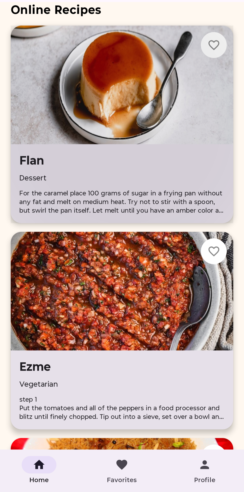
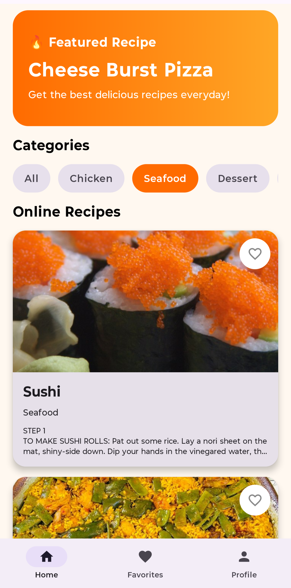
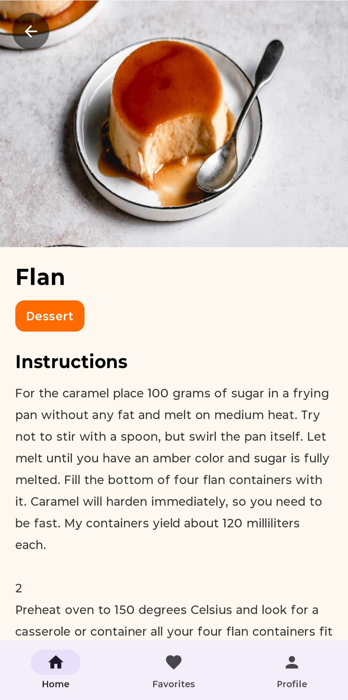
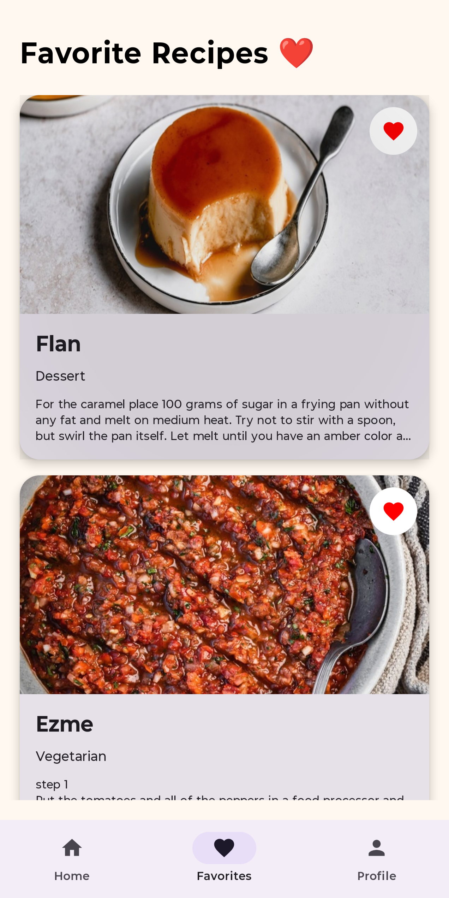
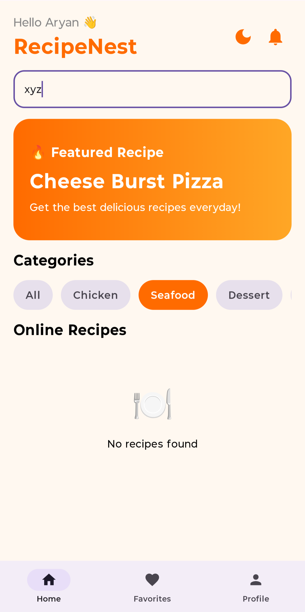

# 🍽️ RecipeNest – Modern Android Recipe App

RecipeNest is a modern Android Recipe Application built using Kotlin and Jetpack Compose in Android Studio as part of the ApexPlanet Android App Development Internship – Task 4.

The app provides a beautiful and smooth user experience with real-time recipe data, modern UI design, API integration, category filtering, persistent favorites, Firebase authentication, offline handling, settings management, notifications, dark mode support, and professional animations.

# ✨ Features

## 🚀 Core Features

- Splash Screen
- Login & Signup Authentication
- Modern Jetpack Compose UI
- Bottom Navigation
- Real-Time Recipe API Integration
- Internet Recipe Images
- Search Functionality
- Recipe Detail Screen
- Favorites Screen
- Profile Screen
- Settings Screen
- Recently Viewed Recipes
- Push Notification UI
- Offline Internet Detection
- Dark Mode Support
- Responsive Layout

## 🌐 API & Backend Features

- Retrofit API Integration
- JSON Parsing using Gson
- Real Recipe Fetching
- Dynamic Recipe Loading
- Pull-to-Refresh Support
- Error Handling UI
- Empty State UI
- Smooth Data Updates
- Search + Category Filtering
- Firebase Authentication
- Persistent User Sessions

## 🎨 UI/UX Features

- Featured Recipe Banner
- Category Filtering
- Shimmer Loading Animation
- Smooth Screen Transitions
- Modern Material 3 Design
- Interactive Favorite Button
- Beautiful Card Layouts
- Professional Typography & Spacing
- Smooth Navigation Animations
- Responsive Compose Layouts

## ❤️ Advanced Features

- Persistent Favorites using Room Database
- Offline Favorite Storage
- Real-Time Favorite Updates
- Animated Navigation Transitions
- Search + Category Combined Filtering
- DataStore Preferences
- Notification Support
- Recently Viewed Recipe Tracking
- Offline Internet Detection Screen

# 🛠️ Technologies Used

| Technology | Purpose |
|---|---|
| Kotlin | Programming Language |
| Jetpack Compose | Modern Android UI |
| Retrofit | API Integration |
| Gson Converter | JSON Parsing |
| Coil | Image Loading |
| Room Database | Local Storage |
| Firebase Authentication | User Authentication |
| DataStore | Preferences Storage |
| Material 3 | UI Components |
| Coroutines | Asynchronous Programming |

# 🌐 API Used

## TheMealDB API

https://www.themealdb.com/api.php

### Used for:

- Fetching recipes
- Recipe images
- Recipe categories
- Recipe instructions
- Search functionality

# 📱 App Screenshots

## 🚀 Splash Screen


---

## 🔐 Login Screen


---

## 📝 Signup Screen


---

## 🏠 Home Screen


---

## 🍱 Online Recipes



---

## 🧩 Category Filtering



---

## 🔍 Search Functionality


---

## 📖 Recipe Detail Screen




---

## ❤️ Favorites Screen




---

## 🌙 Dark Mode


---

## 👤 Profile Screen


---

## ⚙️ Settings Screen


---

## 🕘 Recently Viewed Recipes


---

## 🔔 Notification UI


---

## 📴 Offline Internet Detection


---

## ⚠️ Empty State UI



# 📂 Project Structure

```bash
com.example.recipenest
│
├── api
│   ├── RecipeApiService.kt
│   ├── FavoriteRecipeDao.kt
│   ├── RecipeDatabase.kt
│   └── RetrofitInstance.kt
│
├── auth
│   ├── LoginScreen.kt
│   ├── SignupScreen.kt
│   └── AuthViewModel.kt
│
├── components
│   ├── CategoryChip.kt
│   ├── FeaturedBanner.kt
│   ├── OnlineRecipeCard.kt
│   ├── RecentRecipeCard.kt
│   ├── ShimmerRecipeCard.kt
│   ├── ThemeManager.kt
│   └── SettingsManager.kt
│
├── model
│   ├── OnlineRecipe.kt
│   ├── FavoriteRecipeEntity.kt
│   └── RecentRecipe.kt
│
├── screens
│   ├── HomeScreen.kt
│   ├── FavoriteScreen.kt
│   ├── ProfileScreen.kt
│   ├── SettingsScreen.kt
│   └── RecipeDetailScreen.kt
│
├── utils
│   ├── NetworkUtils.kt
│   ├── NotificationHelper.kt
│   ├── RecentRecipeManager.kt
│   └── SettingsDataStore.kt
│
└── MainActivity.kt
```
